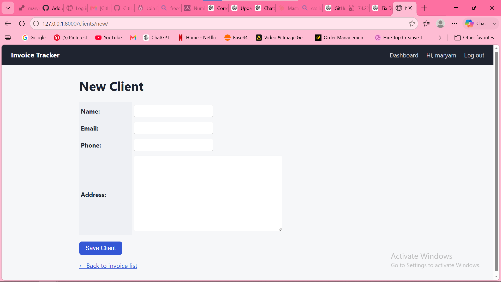
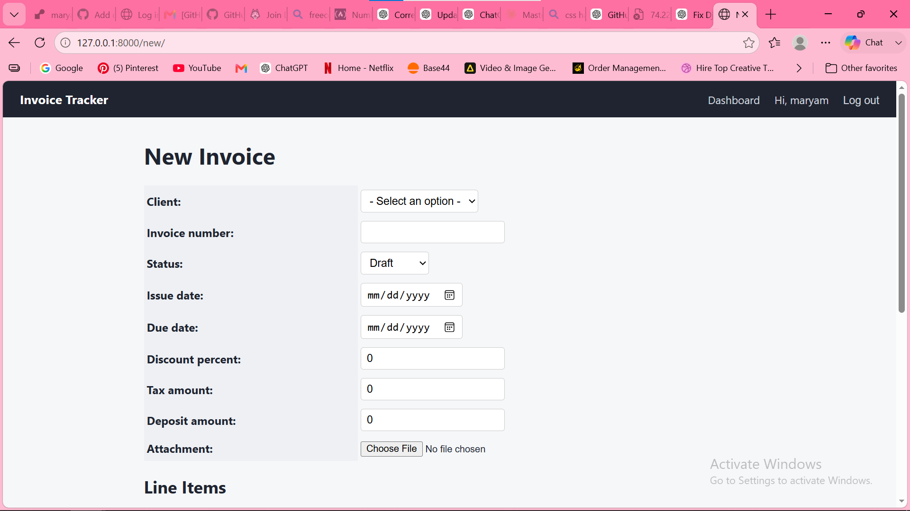
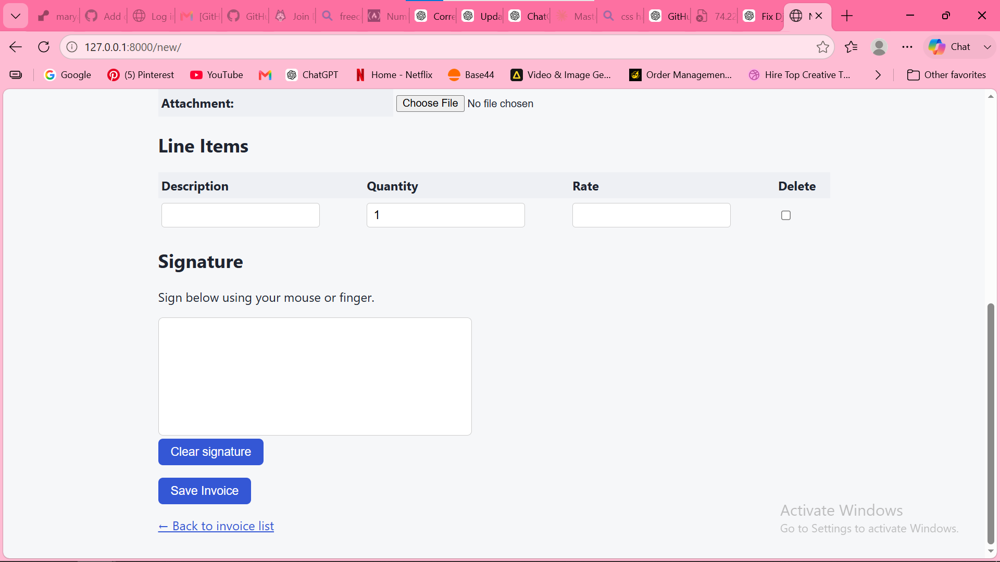

# Invoice Tracker

A Django web application that lets freelancers and small businesses create, manage, and send professional invoices — without relying on spreadsheets.

## Features
- **Client management** — store client name, email, phone, and address for reuse across invoices
- **Invoice creation** — add line items (description, quantity, rate), automatic subtotal/total calculation
- **Discounts, tax, and deposits** — apply a discount percentage, tax amount, and track deposits paid, with the remaining balance calculated automatically
- **File attachments** — attach supporting documents or images to an invoice
- **E-signature capture** — clients can sign directly in the browser using mouse or touch
- **PDF export** — download a finished invoice as a clean, printable PDF
- **Status tracking** — mark invoices as Draft, Sent, or Paid

## Tech stack
- **Backend:** Python, Django
- **Database:** SQLite
- **Frontend:** HTML, CSS (Django templates)

## Screenshots

| New Client | New Invoice | Line Items & Signature |
|---|---|---|
|  |  |  |

**Generated PDF:**


## Setup

```bash
# Clone the repo
git clone https://github.com/mafoudmaryam/invoice-tracker.git
cd invoice-tracker

# Create a virtual environment
python -m venv venv
source venv/bin/activate   # Windows: venv\Scripts\activate

# Install dependencies
pip install -r requirements.txt

# Run migrations
python manage.py migrate

# Start the server
python manage.py runserver
```

Then visit `http://127.0.0.1:8000/` in your browser.

## What I learned
Building this project helped me practice Django's model-view-template structure, handling forms and file uploads, working with relational data (clients ↔ invoices ↔ line items), and generating PDFs dynamically from database records.
